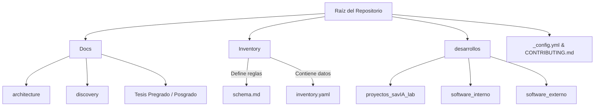

# Estado y Evolución del Repositorio

Este documento describe la estructura actual del repositorio, la responsabilidad de cada directorio y el plan de evolución previsto a medida que el proyecto crezca.

# 🏗️ Arquitectura del Repositorio

## 📂 Estructura de Directorios

```text
.
├── _config.yml
├── CONTRIBUTING.md
├── README.md
├── desarrollos/
│   ├── proyectos_savIA_lab/
│   ├── software_externo/
│   └── software_interno/
├── Docs/
│   ├── architecture/
│   ├── discovery/
│   ├── tesis_de_posgrado/
│   └── tesis_de_pregrado/
└── Inventory/
    ├── inventory.yaml
    └── schema.md
```

| Ruta / Archivo | Tipo | Propósito y Descripción |
| :--- | :---: | :--- |
| `_config.yml` | Archivo | Configuración global del sitio web o repositorio (p. ej., GitHub Pages o Jekyll). |
| `CONTRIBUTING.md` | Archivo | Guía con normas, flujos de trabajo y directrices para colaboradores del proyecto. |
| `README.md` | Archivo | Documento principal con la presentación, instrucciones de inicio e información general. |
| `desarrollos/` | Directorio | Carpeta raíz que agrupa todo el código fuente, módulos y desarrollos. |
| `desarrollos/proyectos_savIA_lab/` | Directorio | Proyectos e iniciativas específicas creadas y mantenidas por el laboratorio **savIA**. |
| `desarrollos/software_externo/` | Directorio | Integraciones, adaptadores y componentes para el consumo de software o servicios de terceros. |
| `desarrollos/software_interno/` | Directorio | Herramientas, librerías y utilidades propias en fase de desarrollo o uso interno. |
| `Docs/` | Directorio | Centro principal de documentación técnica, académica y procesos del sistema. |
| `Docs/architecture/` | Directorio | Diseños conceptuales, diagramas de flujo, esquemas e infraestructura del sistema. |
| `Docs/discovery/` | Directorio | Investigación previa, análisis de requisitos, prototipos conceptuales y hallazgos. |
| `Docs/tesis_de_posgrado/` | Directorio | Documentación, recursos y avances de investigación pertenecientes a tesis de posgrado. |
| `Docs/tesis_de_pregrado/` | Directorio | Documentación, memorias y entregables asociados a proyectos de tesis de pregrado. |
| `Inventory/` | Directorio | Módulo de gestión centralizada de recursos e inventario del entorno. |
| `Inventory/inventory.yaml` | Archivo | Base de datos estructurada en formato YAML con el registro en detalle de los recursos. |
| `Inventory/schema.md` | Archivo | Definición, reglas de validación y estructura esperada para el archivo `inventory.yaml`. |


